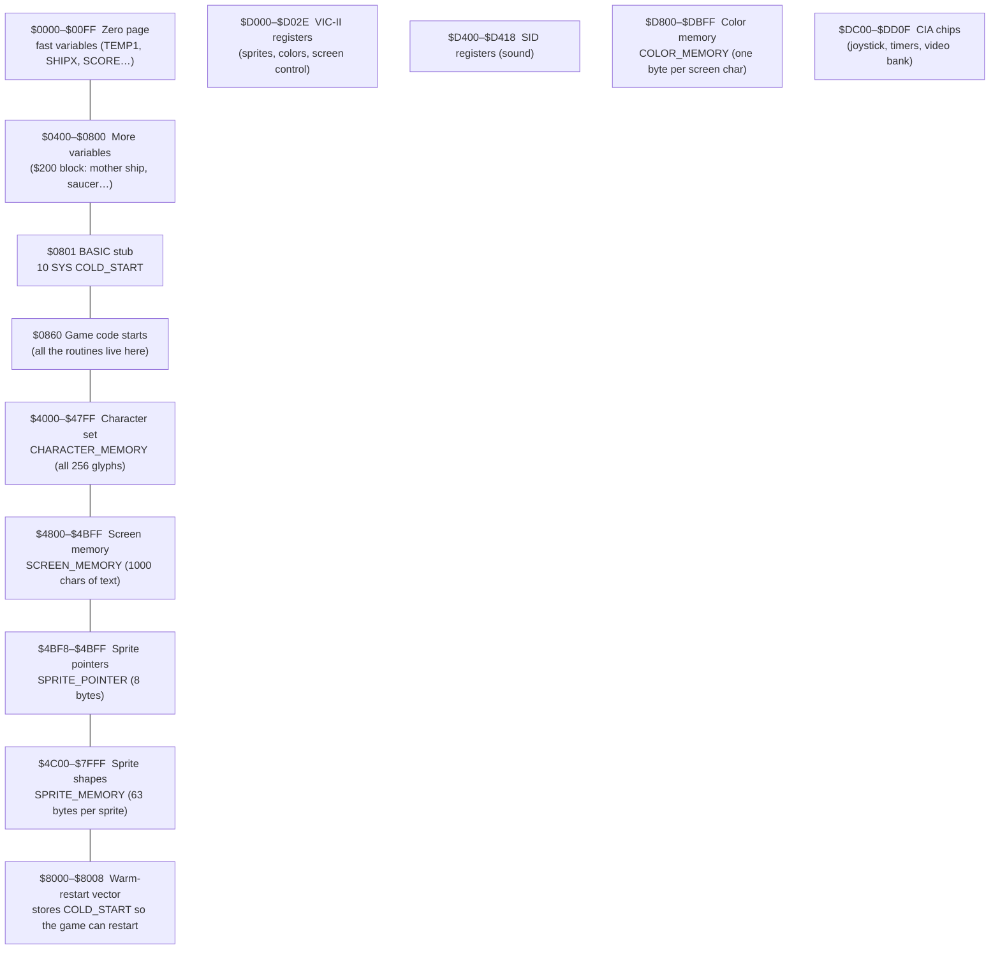
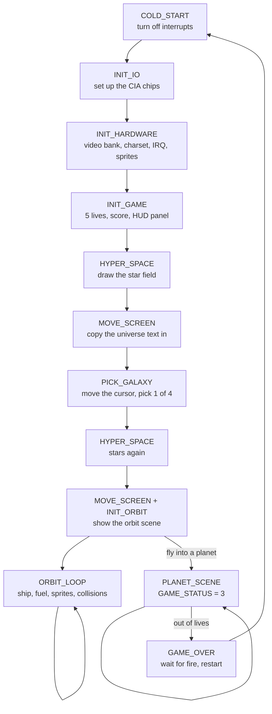
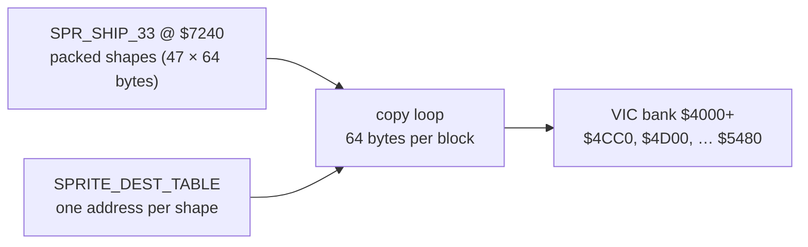

# HOW_IT_WORKS.md — Moonsweeper for the C64, explained

*Welcome! This document is a guided tour of **Moonsweeper** (Imagic, 1984,
by Daniel Filiberti / A.C.T) for the Commodore 64. It is written for people
who are learning **6502 assembly language** and want to see how a real,
finished game works — from the hardware up.*

> **Before you start:** you don't need to read everything at once. Skim the
> memory map and the game flow first, then dive into whichever subsystem
> sounds interesting. Every section ends with a **Try it!** experiment, and
> there's a whole list of them at the end.

---

## 1. The C64 in 5 minutes

A C64 is a computer built around the **6510 CPU** (a close cousin of the
6502). Three helper chips do the heavy lifting:

| Chip | What it does | Where the game talks to it |
|------|--------------|----------------------------|
| **VIC-II** | Draws the picture: text, colors, sprites | `$D000`–`$D02E` |
| **SID** | Makes sound (3 voices) | `$D400`–`$D418` |
| **CIA 1 & 2** | Joystick, keyboard, timers, selects which 16 KB "bank" the VIC reads | `$DC00`–`$DD0F` |

The three ideas you need before the game makes sense:

1. **The VIC-II reads its graphics from normal RAM.** The screen is just a
   list of character codes in RAM. The shapes of those characters live in a
   *character set* elsewhere in RAM. Sprites are little 24×21 pixel images
   stored in RAM too.
2. **The VIC-II can only see 16 KB at a time** — the *video bank*. You tell
   it which 16 KB block to use by writing to a CIA register (`$DD00`).
3. **Everything is memory-mapped.** Want to move a sprite? Store a new X
   position into a register address. Want sound? Store values into SID
   addresses. The "hardware" is just addresses you poke from assembly.

**The video bank trick.** The VIC's 16 KB window can start at `$0000`,
`$4000`, `$8000`, or `$C000`, chosen by the bottom 2 bits of `$DD00`.
Moonsweeper uses the `$4000` bank. Here is the sneaky part — the mapping is
*inverted*:

| `$DD00` & 3 | VIC bank |
|-------------|----------|
| `%00` | `$C000` |
| `%01` | `$8000` |
| `%10` | `$4000` ← Moonsweeper uses this one |
| `%11` | `$0000` |

`INIT_HARDWARE` (in `MOONCOD2.ASM`) sets it up:

```asm
LDA PORTA2        ; $DD00
AND #$FC          ; keep the upper bits
ORA #$02          ; bottom two bits = %10  ->  bank $4000
STA PORTA2
LDA #$20
STA VIC_MEMORY    ; $D018: screen at $4800, charset at $4000
```

---

## 2. The memory map

This is the single most useful picture for understanding the game. Whenever
you see an address in the code, come back here:



Why does it matter? Because a C64 game is really just **moving bytes around
in these regions**:

- **Screen text** → store character codes into `$4800` + offset
- **Text colors** → store color numbers into `$D800` + same offset
- **A sprite's shape** → store a *pointer byte* at `$4BF8` + sprite number
- **Move a sprite** → store X into `$D000` (+2×sprite), Y into `$D001`

All of these are just equates at the top of `MOONEQU.ASM`:

```asm
CHARACTER_MEMORY = $4000
SCREEN_MEMORY    = $4800
SPRITE_POINTER   = SCREEN_MEMORY+$3F8   ; = $4BF8
SPRITE_MEMORY    = $4C00
COLOR_MEMORY     = $D800
SPRITE_XPOS      = $D000   ; plus 2*sprite number!
SPRITE_YPOS      = $D001
```

**The sprite pointer math.** Pointer `$52` means "sprite shape number
`$52`". The VIC multiplies by 64: `$4000 + $52*64 = $5480`. So
`SPR_GALAXY_CROSS_52` (a shape in `MOONSPRT.ASM`) ends up displayed at
`$5480`. 64 bytes per sprite: 21 rows × 3 bytes, plus 1 spare byte.

---

## 3. The game flow

Everything hangs off `COLD_START` at the top of `MOONCOD1.ASM`:



The main loop is tiny — most of the work happens in the **interrupt**
(raster IRQ) every frame. The game uses `GAME_STATUS` to know which screen
it's on:

| Value | Meaning |
|-------|---------|
| `0` | Universe / galaxy screen |
| `1` | Orbit screen |
| `2` | Into the moon (scrolling) |
| `3` | On the moon (planet scene) |
| `4` | Taking off |

---

## 4. The subsystems

### 4.1 Reading the joystick (`GETPORT`)

There is one function you should read before anything else, because almost
every other routine uses it. It's at the end of `MOONCOD3.ASM`:

```asm
GETPORT LDA PORTA1     ; $DC00
        AND PORTB1     ; $DC01  (combined with port 2)
        AND #$1F       ; keep only joystick bits
        RTS
```

`GETPORT` returns a byte where the low 5 bits are:
`bit 0 = up`, `bit 1 = down`, `bit 2 = left`, `bit 3 = right`,
`bit 4 = fire`. A `0` means **pressed** (the pins are active-low!).

So `JSR GETPORT` followed by `ROR` / `BCS` is the standard way to test one
direction: `ROR` rotates the next bit into the carry flag, and `BCS` jumps
if that direction is *not* pressed.

**Try it!** Find `PICK_GALAXY` in `MOONCOD2.ASM` and trace how `ROR; BCS`
checks up, down, left, right — one after another — with `PHA`/`PLA` saving
the joystick byte between tests.

### 4.2 The galaxy screen (`PICK_GALAXY`)

After the hyperspace star field, the player picks one of four galaxies.
The cursor is **sprite 0**:

```asm
PICK_GALAXY LDA #$52
            STA SPRITE_POINTER     ; point sprite 0 at shape $52
            LDA #$6F
            STA SPRITE_YPOS        ; start in the middle
            LDA #$A4
            STA SPRITE_XPOS
_11         JSR GETPORT
            ROR                    ; up?
            BCS _1
            ...                    ; move sprite Y up one
            ...
_8          INC SPRITE_COLOR       ; make the cursor flash
```

Then it compares the cursor's X/Y against the `X1/X2/Y1/Y2` tables to decide
which of the 4 galaxies is selected, and stores the result in `GALAXY`.

The sprite shape itself is `SPR_GALAXY_CROSS_52` in `MOONSPRT.ASM` — a
little vertical bar. It was recovered from the original tape because the
converted source didn't include sprite data.

**Try it!** Change `LDA #$6F` to `LDA #$A0` and watch the cursor start lower.
Change the bytes in `SPR_GALAXY_CROSS_52` and the cursor looks different.

### 4.3 The orbit screen and the ship (`DO_SHIP`)

`DO_SHIP` in `MOONCOD1.ASM` is the heart of the game. It:

1. **Moves the ship** left/right by ±1 pixel, checking the boundaries
   (`$18` left, `$48` right), and tracking the X high bit for sprites that
   cross the 256-pixel boundary.
2. **"Banks" the ship** — as you hold left or right, `BANK_STAGE` counts up
   or down, and `CALC_SHIP_STAGE` picks one of 5 ship pictures
   (pointers `$33`–`$37`) so the ship *leans* into the turn, just like a
   real plane banking.
3. **Runs an action table** — it reads the joystick and jumps through
   `EXECUTION_TABLE`, a table of routine addresses:

```asm
EXECUTION_TABLE .word DO_UP
                .word DO_DOWN
                .word DO_LEFT
                .word DO_RIGHT
                .word DO_SHOOT
```

The clever bit: `DO_SHIP_4` does `ROR` (next joystick bit), and if the bit
is clear (pressed) it pushes a return address on the stack and does
`JMP (TEMP1)` to *jump to the routine through the table*. That's how a
table of pointers turns into a computed jump — no giant `CMP/BNE` ladder.

### 4.4 The gauges on the HUD

The control panel along the bottom is drawn by `PANEL` in `MOONCOD2.ASM`,
which copies 160 bytes of *screen codes* and *colors* from the game data
into screen memory:

```asm
PANEL   LDX #$A0
_1      LDA UNIV_SCR+$347,X   ; panel text codes
        STA SCREEN_MEMORY+$347,X
        LDA UNIV_ATR+$347,X   ; panel colors
        STA COLOR_MEMORY+$347,X
        DEX
        BNE _1
        RTS
```

The VEL and FUEL meters are **sprites** that slide along the panel:

- `DO_VELOCITY` — converts `VELOCITY` (1–15) into a sprite pointer
  (dial pictures `$B6`–`$C4`, middle at `$BD`) and an X position. Speed 8
  is the middle.
- `DO_FUEL` — burns fuel (`FUEL = FUEL - 1` each tick, or faster with the
  shield on), then slides `FUEL_IND` down from `$C4` to `$B6`. Out of fuel
  starts the blow-up sequence.
- `DO_BANK_INDICATOR` — slides a marker left/right to show the ship's bank.

These needle sprites live at `$6D40`–`$7100` and were recovered from the
tape's RAM, not the source.

**The charset gotcha.** The VIC's screen codes 0–23 are the HUD glyphs
(VEL, FUEL, the bar, the meter). Sprite shapes for the mother ship happen to
be copied to `$4000`… which overwrites those very characters! `INIT_HARDWARE`
fixes it by copying the character set back over chars 0–23 after the sprites
are loaded. It's a reminder that on a C64, **charset, screen, and sprites
all share the same RAM and can clobber each other.**

### 4.5 Orbit objects (`DO_ORBIT`)

`DO_ORBIT` in `MOONCOD3.ASM` moves up to 5 "object" sprites (planets,
comets, satellites, stranded men, rings). Each object has a whole set of
shadow variables in zero page — `OBJECT_TYPE`, `XSPRITE`, `YSPRITE`,
`SPRITE_STATUS`, `EXPLODE_FLAG`, `CRATER_FLAG`… — one byte each, indexed
0–4.

Sprites are launched one at a time (`START_DELAY`), then follow a
**parabola** computed by `GET_PICTURE` and `CALCULATE_XMOVE` using the
`PARABOLA` tables. When they leave the screen they're recycled into new
objects.

The shadows exist because the real sprite registers can only be written in
the IRQ (mid-frame). The main loop updates the *shadow* variables; the IRQ
copies shadows → hardware every frame.

### 4.6 Collisions (`COLLISION_DETECT`, `PLANET_COLLISIONS`)

The VIC-II sets collision flags in `$D01E`/`$D01F` automatically when
sprites overlap. But you can only read those registers **once** — the game
reads them inside the IRQ at different raster lines and stashes the results
in `TOP_COLLIDE`, `MID_COLLIDE`, and `SHIP_COLLIDE`.

- `COLLISION_DETECT` (`MOONCOD3`) — for the orbit screen. Rotates through
  the collision bits to find *which* sprite the ship hit, checks its
  `OBJECT_TYPE`, and either kills the ship or (if it's a planet) starts the
  into-the-moon sequence.
- `PLANET_COLLISIONS` (`MOONCOD5`) — for the planet scene. Handles picking
  up men (+100 points each, `DO_MEN_PICKED_UP`), rings, and the shot hitting
  objects (+50 points, an explosion sprite).

### 4.7 The planet scene and scrolling (`INTO_PLANET` → `PLANET_SCENE`)

Flying into a planet switches `GAME_STATUS` to `2`, then `3`. The "into the
moon" effect is a real highlight: instead of moving sprites, the game
**scrolls the screen** and swaps **character set glyphs** to fake a rolling
surface — `LOAD_STRIPES` rewrites the charset itself while `SCROLL_UP`
moves screen lines. That's the retro trick of "redefine the characters to
make the world move."

The planet scene (`PLANET_SCENE`, `MOONCOD3`) adds:
- **Stripes** — the rolling ground
- **The mother ship & satellite** (`DO_MOTHER_SHIP`, `MOONCOD4`) — big
  sprites that weave on sine-wave paths
- **The saucer** — homes in on the ship (`SAUCER_AIM_TIME` table) and fires
- **The radar** — a small ship blip that tracks the saucer (`DO_RADAR_SHIP`)

### 4.8 Sound (`DO_SOUNDS`)

Sound is driven by flags and a tiny **note player**. Routines set
`BLOWUP_SND`, `SHOT_SND`, `SPACE_SND`, or point `NOTE_POINTER` at a note
table (`BLOWUP_SOUND_TBL`, `MAN_SOUND_TBL`, `INTO_PLANET_TBL`). The IRQ
steps through the note tables to play melodies, and `DO_SOUNDS`
(`MOONCOD4`) feeds the SID registers directly for the engine hum, shots,
and explosions.

### 4.9 The raster IRQ (`MOONIRQ.ASM`)

This is where the frame-by-frame magic happens. The game chains a series
of **raster IRQs** — each one fires on a different scanline, does its
part, and programs `RASTER` + the interrupt vector so the *next* one fires
later in the same frame:

1. **IRQ1** (top) — draws the shot sprite and the orbit-object sprites from
   their shadow variables, reads sprite/sprite collision.
2. **IRQ2** (middle) — for the planet scene: draws those sprites and
   changes the background color mid-screen for the horizon effect; reads
   collision again. (During the into-the-moon scroll it does the sync
   instead.)
3. **IRQ3** (lower) — draws the ship sprite and the shield, reads collision
   again.
4. **IRQ4 / PANEL_IRQ** (bottom, at the HUD) — draws the VEL/FUEL dials
   and the radar blips, reads the last collision data, and advances the
   random number generator.

The game generates its "random" numbers with a tiny software generator in
the IRQ — an **XOR-shift**. Starting from a seed, each frame it shifts and
XORs the value with itself:

```asm
LDA RANDOM_NUMBER
ASL
EOR RANDOM_NUMBER
ASL
ROL RANDOM_NUMBER
```

It's not true randomness — it's a *pseudo*-random sequence, but it's more
than random enough for a game.

---

## 5. How the sprites get into memory

The original S-C source contained **no sprite shape data** — only the
pointers. The shapes were recovered from the released tape and live in
`MOONSPRT.ASM`, all 47 shapes packed one after another at `$7240`.

`INIT_SPRITES` (called from `INIT_HARDWARE`) walks two tables in lockstep —
the packed shapes and a destination table — and copies 64 bytes at a time
into the VIC bank:



The last entry is the galaxy cursor:

```asm
    .word $5480   ; GALAXY_CROSS ptr $52
SPRITE_BLOCK_COUNT = 47
```

So "ptr $52" is only meaningful because `INIT_SPRITES` copied a shape to
`$5480 = $4000 + $52*64` at startup. Change a shape's bytes in
`MOONSPRT.ASM` and the picture changes; change the dest table and the
pointer means something different.

---

## 6. Hands-on experiments

The whole point of a source you can rebuild is to *change things and see
what happens*. Rebuild with **Ctrl+Shift+B** and run with the **Run in
VICE** task.

**Easy (one line):**

1. **Ship color** — in `INIT_ORBIT` (`MOONCOD1.ASM`) find
   `LDA #<WHITE / STA SHIP_COLOR` and change `WHITE` to `RED` or `GREEN`.
2. **Cursor starting position** — in `PICK_GALAXY`, change
   `LDA #$6F` (Y) or `LDA #$A4` (X).
3. **More lives** — in `INIT_GAME` (`MOONCOD2.ASM`), `LDA #$05 / STA LIVES`
   → `#$07`. (The HUD panel has room to draw up to 7 ships, so 7 fills it!)
4. **Slower fuel burn** — in `MOONEQU.ASM`, `FUELBURN = $40` → a bigger
   number burns slower.
5. **Faster ship** — `MAXIMUM_VEL = $0F` → `$1F`.

**Medium:**

6. **Reshape the galaxy cursor** — edit the bytes in
   `SPR_GALAXY_CROSS_52` in `MOONSPRT.ASM` to draw a plus sign or an arrow.
   (You can use `tools/gen_sprites.py` or just hand-edit the 64 bytes.)
7. **Change the background color** of the galaxy screen — find where the
   universe screen is drawn and store a different value to `BACKGROUND_COLOR`
   (`$D021`).
8. **Score more per man** — in `PLANET_COLLISIONS`, the man pickup sets
   `SCORE_TEMP+1` to `1` (100 points). Change it to `2` for 200.

**Adventurous:**

9. **Add a sixth object sprite.** The orbit scene uses 5
   (`ORBIT_SPRITE` arrays are 5 bytes). Try growing the arrays and the
   `DO_ORBIT` loop limit (`CPX #$04` → `#$05`). You'll need a free sprite
   slot and its IRQ handling too — a great way to learn how the pieces
   connect.
10. **Make the shield last longer.** `DO_SHIELD` cycles 6 colors; change
    `CMP #$06` to `#$0C` and add colors to `COLORS_FOR_SHIELD`.
11. **Add a sound** — copy an existing note table and trigger it from
    `DO_SOUNDS` with your own flag.

---

## 7. Where everything lives (quick reference)

| Topic | File | Key routine(s) |
|-------|------|----------------|
| Entry point, main loop, ship, gauges | `MOONCOD1.ASM` | `COLD_START`, `DO_SHIP`, `DO_VELOCITY`, `DO_FUEL`, `BLOW_UP_SHIP` |
| Hardware init, galaxy screen, HUD panel | `MOONCOD2.ASM` | `INIT_HARDWARE`, `INIT_IO`, `INIT_GAME`, `PANEL`, `PICK_GALAXY`, `MOVE_SCREEN` |
| Orbit objects, collisions, planet scene, joystick | `MOONCOD3.ASM` | `DO_ORBIT`, `COLLISION_DETECT`, `INTO_PLANET`, `PLANET_SCENE`, `GETPORT` |
| Mother ship, saucer, radar, sound | `MOONCOD4.ASM` | `DO_MOTHER_SHIP`, `DO_SOUNDS` |
| Planet-scene collisions | `MOONCOD5.ASM` | `PLANET_COLLISIONS` |
| Frame-by-frame sprite/collision updates | `MOONIRQ.ASM` | `IRQ1`, `IRQ2`, `IRQ3` |
| Equates, variables, memory map | `MOONEQU.ASM` | (all the `= $xxxx` definitions) |
| Sprite shapes + copy routine | `MOONSPRT.ASM` | `SPR_*`, `INIT_SPRITES` |
| Character set & panel data | `MOON.SHAPES.1`, `MOON.SHAPES.2` | `GAMESET`, `UNIV_SCR`, `UNIV_ATR`, `ORBIT_SCR` |
| Macros | `MOONMACR.ASM` | `ADD`, `SUB`, `BUILD`, `INC16`, `PRINT_MACRO` |

*Want to know how the source was converted from the original S-C Macro
Assembler format? See `SC_TO_64TASS.md`. Want to build and verify it? See
`README.md`.*
